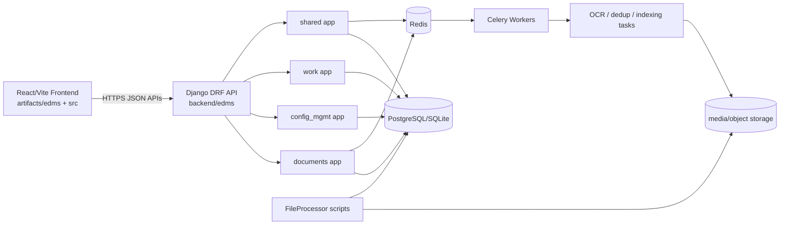

# Phase 1 — Codebase Discovery: Dependency and Flow Map

## 1) Top-level structure

| Path | Role |
|---|---|
| `backend/` | Django + DRF API service, Celery tasks, domain apps (`documents`, `work`, `config_mgmt`, `shared`). |
| `src/` | Frontend UI source tree (TypeScript/React style project files). |
| `artifacts/edms/` | Primary Vite React application artifact workspace. |
| `artifacts/api-server/` | Node API/server artifact workspace (support tooling/prototyping). |
| `artifacts/mockup-sandbox/` | UI sandbox workspace. |
| `lib/` | Shared workspace libs (`api-spec`, `api-zod`, `api-client-react`, `db`). |
| `scripts/` | Utility scripts and tooling helpers. |
| `FileProcessor/` | File processing utilities and dedup/index support scripts. |
| `artifacts/` | Build/runtime artifact group for frontend + mock services. |

## 2) Dependency manifests

### Python
- `backend/requirements.txt`
- `backend/requirements-ocr.txt`
- `backend/requirements-loadtest.txt` (added for Locust test plan)

### Node/TypeScript (pnpm workspace)
- Root: `package.json`, `pnpm-lock.yaml`, `pnpm-workspace.yaml`
- Workspace packages:
  - `artifacts/edms/package.json`
  - `artifacts/api-server/package.json`
  - `artifacts/mockup-sandbox/package.json`
  - `lib/api-spec/package.json`
  - `lib/api-zod/package.json`
  - `lib/api-client-react/package.json`
  - `lib/db/package.json`
  - `scripts/package.json`

## 3) Environment and settings configuration files

- `backend/.env.example`
- `backend/edms/settings.py`
- `backend/edms/settings_api.py`
- `artifacts/edms/.env.production` (frontend runtime env template)
- `backend/gunicorn_config.py`

## 4) Database migration files

- `backend/documents/migrations/*.py`
- `backend/edms_api/migrations/*.py`
- `backend/shared/migrations/*.py`
- `backend/work/migrations/*.py`
- `backend/config_mgmt/migrations/*.py`
- `backend/integrations/migrations/*.py` (init currently)

## 5) API route definitions

### Django URL entry points
- `backend/edms/urls.py`
- `backend/edms/api_v1_urls.py`
- `backend/edms/legacy_api_urls.py`

### App-level routes
- `backend/shared/urls.py`
- `backend/documents/urls.py`
- `backend/config_mgmt/urls.py`
- `backend/work/urls.py`

### Frontend route map
- `src/src/routes.ts`

## 6) Test files and coverage config

### Backend tests
- `backend/documents/tests.py`
- `backend/edms_api/tests.py`
- `backend/config_mgmt/tests/test_bom_services.py`
- `backend/config_mgmt/tests/test_bom_update_validation.py`
- `backend/config_mgmt/tests/test_services.py`
- `backend/tests/test_bom_services.py`
- `backend/tests/test_search_indexing.py`

### Frontend/tests
- `src/src/lib/bomData.test.ts`
- `artifacts/edms/vitest.config.ts`

### Coverage config status
- No explicit `.coveragerc` at repository root.
- No pytest-specific coverage plugin config discovered.

## 7) Deployment / operations / CI-CD assets

- `backend/gunicorn_config.py`
- `backend/nginx.conf`
- `DEPLOYMENT.md`
- `backend/LOCAL_SETUP.md`
- No `.github/workflows/*` CI pipelines found.
- No Dockerfile / docker-compose manifests found.

## 8) Inter-service and inter-module dependency map

## 9) Request/processing flow highlights

1. **Auth flow**: frontend calls `/api/v1/auth/token/` or `/api/v1/auth/login/`; JWT bearer token drives DRF authenticated endpoints.
2. **Document flow**: upload/create via `documents` routes, metadata persisted to DB, optional OCR and dedup follow-up via background processing stack.
3. **PL/config flow**: PL/BOM endpoints in `config_mgmt` coordinate linked documents and revision structures.
4. **Work ledger flow**: `work-records`, `approvals`, and export jobs under `work` app and shared reporting endpoints.
5. **Observability flow**: shared middleware injects request context/correlation into logging; health endpoint exposed at `/api/v1/health/status/`.

## 10) Discovery risks flagged before deeper audit

- Security-sensitive settings previously relied on hardcoded CORS defaults at import layer and weak debug fallback behavior.
- No CI/CD workflow files detected; release quality gates are not currently enforced by pipeline automation.
- No in-repo Docker baseline for reproducible deployment smoke checks.
- Dependency vulnerability scanning is constrained in this environment due package registry/proxy restrictions (documented in phase reports).
